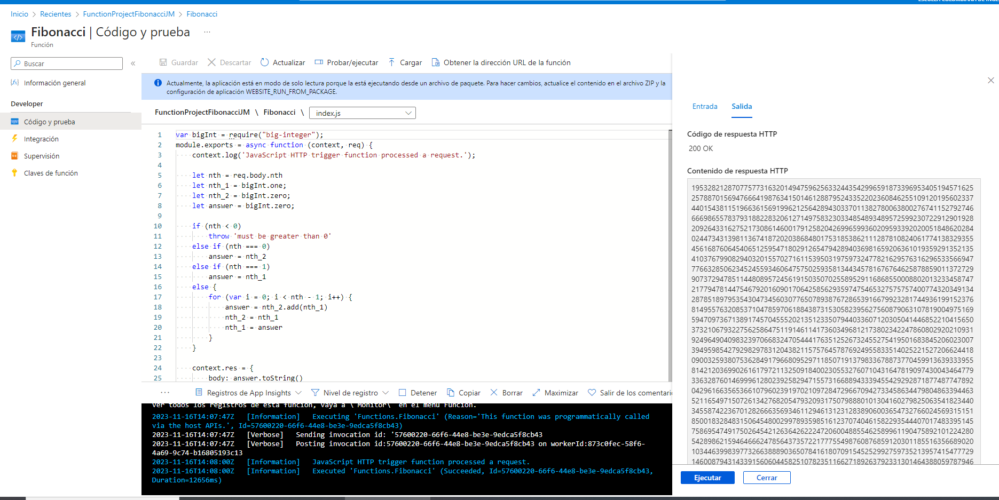
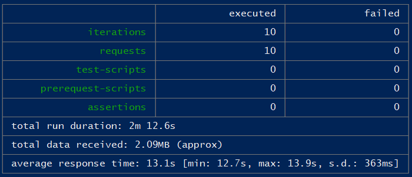
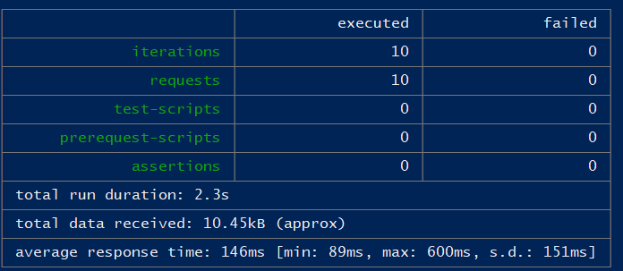
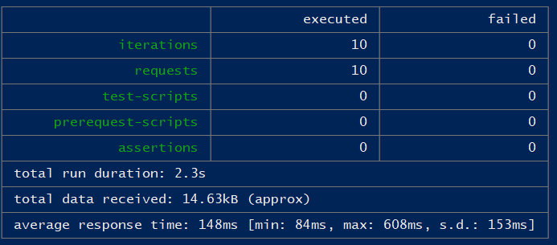
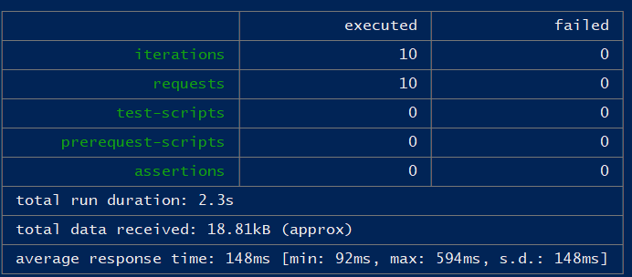
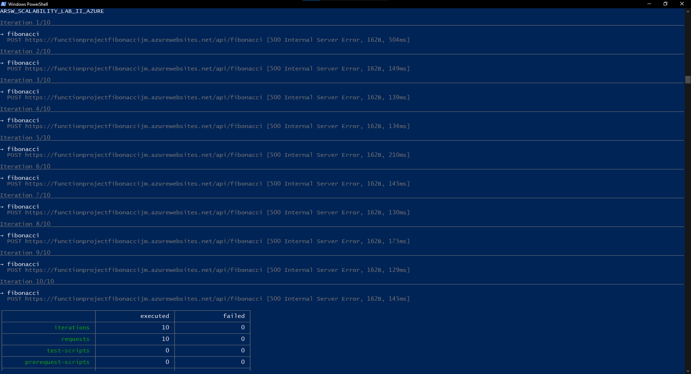
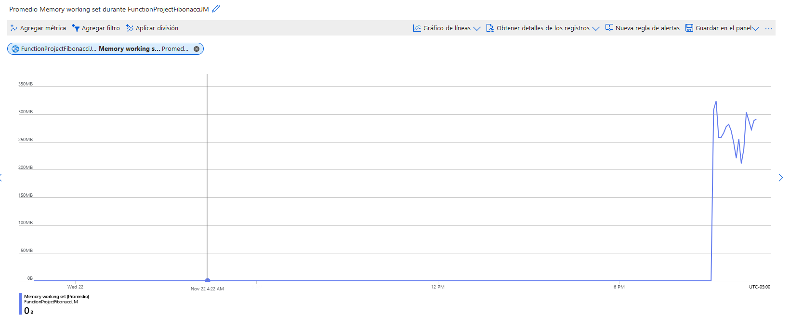

### Escuela Colombiana de Ingeniería
### Arquitecturas de Software - ARSW

## Escalamiento en Azure con Maquinas Virtuales, Sacale Sets y Service Plans

### Dependencias
* Cree una cuenta gratuita dentro de Azure. Para hacerlo puede guiarse de esta [documentación](https://azure.microsoft.com/es-es/free/students/). Al hacerlo usted contará con $100 USD para gastar durante 12 meses.
Antes de iniciar con el laboratorio, revise la siguiente documentación sobre las [Azure Functions](https://www.c-sharpcorner.com/article/an-overview-of-azure-functions/)

### Parte 0 - Entendiendo el escenario de calidad

Adjunto a este laboratorio usted podrá encontrar una aplicación totalmente desarrollada que tiene como objetivo calcular el enésimo valor de la secuencia de Fibonnaci.

**Escalabilidad**
Cuando un conjunto de usuarios consulta un enésimo número (superior a 1000000) de la secuencia de Fibonacci de forma concurrente y el sistema se encuentra bajo condiciones normales de operación, todas las peticiones deben ser respondidas y el consumo de CPU del sistema no puede superar el 70%.

### Escalabilidad Serverless (Functions)

1. Cree una Function App tal cual como se muestra en las  imagenes.

2. Instale la extensión de **Azure Functions** para Visual Studio Code.

3. Despliegue la Function de Fibonacci a Azure usando Visual Studio Code. La primera vez que lo haga se le va a pedir autenticarse, siga las instrucciones.

4. Dirijase al portal de Azure y pruebe la function.

Prueba realizada:

5. Modifique la coleción de POSTMAN con NEWMAN de tal forma que pueda enviar 10 peticiones concurrentes. Verifique los resultados y presente un informe.

6. Cree una nueva Function que resuleva el problema de Fibonacci pero esta vez utilice un enfoque recursivo con memoization. Pruebe la función varias veces, después no haga nada por al menos 5 minutos. Pruebe la función de nuevo con los valores anteriores. ¿Cuál es el comportamiento?.

Prueba para 5000

Prueba para 7000

Prueba para 9000

Prueba para 18000 

Cuando se trabajan con números muy grandes, la implementación recursiva original puede generar errores debido a los límites de la pila de llamadas en JavaScript. En cambio, al utilizar números más pequeños, la respuesta es más rápida y consume menos memoria, ya que la recursión se realiza de manera más eficiente.

**Preguntas**

* ¿Qué es un Azure Function?

    - Azure Functions es un servicio en la nube que permite a los desarrolladores ejecutar código sin servidor. Las funciones son pequeñas piezas de código que se ejecutan en respuesta a eventos, como la recepción de una solicitud HTTP, la recepción de un mensaje de cola o la programación de una tarea.

* ¿Qué es serverless?

    - Serverless es un modelo de computación en el que el proveedor de la nube se encarga de la infraestructura subyacente. Los desarrolladores pueden centrarse en escribir el código y no preocuparse por la gestión de servidores.

* ¿Qué es el runtime y que implica seleccionarlo al momento de crear el Function App?

    - El runtime es el entorno de ejecución que se utiliza para ejecutar las funciones de Azure. Hay varios runtimes disponibles, cada uno con sus propias características y capacidades.

* ¿Por qué es necesario crear un Storage Account de la mano de un Function App?

    - Para utilizar los desencadenadores de almacenamiento. Los desencadenadores de almacenamiento son eventos que activan una función de Azure en respuesta a la creación, modificación o eliminación de un objeto de almacenamiento. Hay varios desencadenadores de almacenamiento disponibles, como el desencadenador de blobs, el desencadenador de colas y el desencadenador de tablas.

* ¿Cuáles son los tipos de planes para un Function App?, ¿En qué se diferencias?, mencione ventajas y desventajas de cada uno de ellos.

    - El plan gratuito de Azure Functions es una buena opción para las aplicaciones de funciones que solo necesitan un número limitado de ejecuciones y almacenamiento.

        - Ventajas:
            - Es una buena opción para las aplicaciones de funciones que solo necesitan un número limitado de ejecuciones y almacenamiento.
        - Desventajas:
            - El número de ejecuciones y almacenamiento gratuitos es limitado.
            - El rendimiento es básico.

    - El plan de consumo de Azure Functions es una buena opción para las aplicaciones de funciones que necesitan un número ilimitado de ejecuciones, pero un almacenamiento limitado.

        - Ventajas:
            - Ofrece un número ilimitado de ejecuciones.
            - Ofrece precios reducidos para las ejecuciones que se ejecutan con frecuencia.
            - El rendimiento es mejorado.
        - Desventajas:
            - Se cobra por el almacenamiento.
            - El rendimiento no es óptimo.

* ¿Por qué la memoization falla o no funciona de forma correcta?

    - La recursividad puede dar lugar a un desbordamiento, ya que los valores iniciales no están en memoria y deben calcularse, lo que puede afectar el flujo de ejecución.

* ¿Cómo funciona el sistema de facturación de las Function App?

    - La facturación en Azure Functions se determina considerando diversos aspectos, incluyendo el tiempo de ejecución de la función, el uso de memoria y la cantidad de veces que se ejecuta. El plan de consumo de Azure Functions se factura de acuerdo con el consumo de recursos y la cantidad de ejecuciones por segundo que requiere tu aplicación.